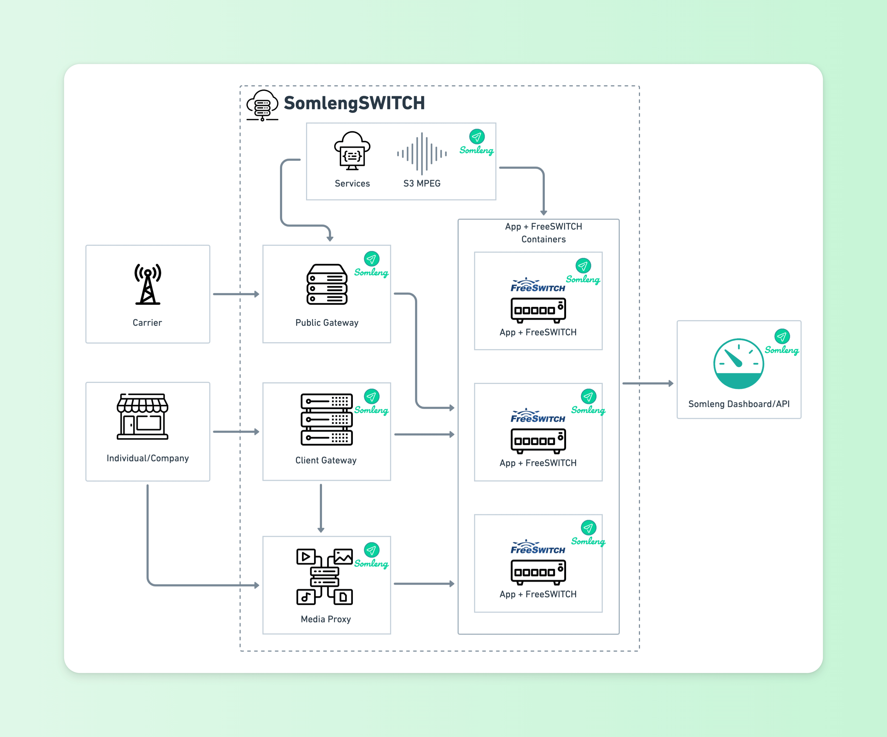

# SomlengSWITCH

SomlengSWITCH (part of [The Somleng Project](https://github.com/somleng/somleng-project)) is used to control programmable voice for Somleng. SomlengSWITCH is made up of a number of components described below.

## Components

### Public Gateway

The Public Gateway is an OpenSIPS powered SIP proxy which can be deployed behind a Network Load Balancer. This gateway is typically used by carriers who wish to connect to Somleng without using SIP registration. A carrier sends SIP requests to the Public Gateway which load balances them to FreeSWITCH containers, which can be deployed in a private subnet for horizontal scaling.

The Public Gateway uses IP address authentication which is configured from the Somleng Dashboard via [IP Address Authentication](https://www.somleng.org/docs.html#sip_trunks_ip_address_configuration).

The Public Gateway *does not* engage the media proxy, and media is send directly between the carrier and the FreeSWITCH container. If the FreeSWITCH instances are deployed behind a NAT with port address translation (PAT) the carrier must support [Symmetric Latching](https://www.somleng.org/docs.html#rtp_symmetric_latching), since the IP/port in the SDP generated by FreeSWITCH will be incorrect and unreachable.

### Client Gateway

The Client Gateway is an OpenSIPS powered SIP proxy designed to be deployed to a single instance. This gateway is typically used by customers who wish to connect to Somleng via SIP registration and do not have a public static IP address. Similar to the Public Gateway, the Client Gateway also handles incoming requests from customers and load balances them to the FreeSWITCH containers, which can be deployed to a private subnet for horizontal scaling.

Unlike the Public Gateway, the Client Gateway uses SIP registration for authentication which is configured from the Somleng Dashboard via [Client Credentials Authentication](https://www.somleng.org/docs.html#sip_trunks_client_credentials_configuration).

The Client Gateway also engages a [Media Proxy](#media_proxy) to bridge media between the FreeSWITCH containers and the client.

### SomlengSWITCH Application

The SomlengSWITCH Application (or just App) controls calls originated from or received by Somleng. It includes logic for fetching and parsing [TwiML](https://www.twilio.com/docs/voice/twiml) from the customer's application and controlling FreeSWITCH. It also includes an application webserver and can receive requests from the Somleng API/Dashboard. The app is deployed along-side the FreeSWITCH containers which are horizontally scaled.

### FreeSWITCH

FreeSWITCH is used as the media server. It is responsible for providing media, recordings, TTS, STT and more. FreeSWITCH is deployed along-side the SomlengSWITCH application and can be deployed in a private non-internet facing subnet. FreeSWITCH containers autoscale out and are registered with the Public Gateway and Private Gateway which act as SIP load balancers.

### Media Proxy

The Media Proxy (powered by [rtpengine](https://github.com/sipwise/rtpengine)) is used by the Client Gateway to proxy media between the FreeSWITCH containers and the UAS.

### Microservices

The following is a list of microservices that support SomlengSWITCH:

#### Services

SomlengSWITCH Services (or just Services) is a microservice which handles the following tasks:

* Updates the load balancer tables when there is a scaling event ensuring that the Public Gateway and Client Gateway know where to send SIP traffic.

* Handles updating media proxy tables when there is a scaling event of a Media Proxy.

* Manages IP addresses and Client Credentials for authentication for the Public Gateway and Client Gateway.

* Handles building dial strings for outbound calls via the Client Gateway

#### S3 MPEG

S3 MPEG is a microservice for converting wav files dropped into a S3 bucket to MP3.

#### Nginx

Nginx webserver configuration for SomlengSWITCH.

#### OpenSIPS Scheduler

A sidecar container which runs along-side the Public Gateway and Client Gateway providing scheduled instructions to OpenSIPS.

#### FreeSWITCH Event Logger

A sidecar container which runs along-side FreeSWITCH providing event logs.

## Getting Started

Please follow the [Getting Started](https://www.somleng.org/docs.html#getting-started) Guide to get up and running. 🏃🏾

## Testing

The [testing](https://github.com/somleng/somleng-switch/tree/develop/components/testing) directory contains [SiPp](https://github.com/SIPp/sipp) scenarios and scripts for integration testing the Public Gateway and Client Gateway together with the Media Proxy, SomlengSWITCH App and FreeSWITCH.

See [build script](https://github.com/somleng/somleng-switch/blob/develop/.github/workflows/integration_tests.yml) for details on how to run the tests.

## Deployment

The [infrastructure directory](https://github.com/somleng/somleng-switch/tree/develop/infrastructure) contains [Terraform](https://www.terraform.io/) configuration files in order to deploy SomlengSWITCH to AWS.

The infrastructure in this repository depends on some shared core infrastructure. This core infrastructure can be found in the [Somleng Project](https://github.com/somleng/somleng-project/tree/master/infrastructure) repository.

## License

The software is available as open source under the terms of the [MIT License](http://opensource.org/licenses/MIT).
